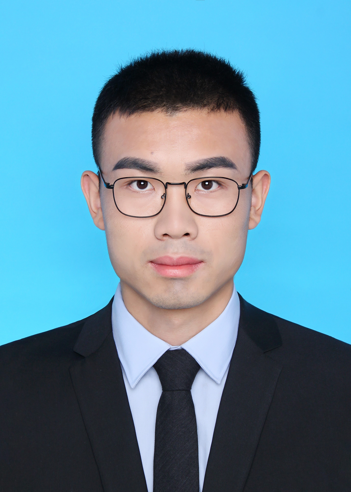

    
    

        李闯
         chuangli@sjtu.edu.cn | 上海交通大学闵行校区
    

我自学能力比较强，喜欢探索新技术、新知识，能够快速进入新的领域。在工作和学习的时候有很强的执行力，守时自律，追求效率。在未来的职业选择中我希望从事互联网相关的工作，我对互联网的未来的发展充满热情，希望在这一行业有所成就。

### 教育经历
---
* **上海交通大学** 2019年9月 - 2022年3月 
  电子信息与电气工程学院 | 电子与通信工程 |   硕士  
  * 相关课程：最优化方法、学术报告会、专业实践、微机电系统、学术英语等 
  * 成绩及荣誉：GPA: 3.85/4 | 上海交通大学一等学业奖学金（2019-2020) 
+ **上海交通大学** 2015年9月 - 2019年6月 
    * 生物医学工程学院 | 生物医学工程 | 本科 
      相关课程：高等数学、医学图像处理、信号处理、算法与数据结构、微机原理、程序设计、电路基础、医学仪器原理等 
   *  安泰经济与管理学院 | 国际经济与贸易 | 本科（第二专业） 
      相关课程：宏微观经济学、管理学、会计学、国际金融，统计学、市场营销学，国际贸易理论等 
    * 成绩及荣誉：学积分：82.46/100 | 上海交通大学学业进步奖学金（2016-2017）| 第六期曾宪梓“优秀大学生奖励计划（2017-2018） 

###  项目及实习经历
---
* **ERP企业实习** 
  前端开发工程师 2018年9月 - 2019年3月 
  * 根据公司需求设计开发Vue组件，并进行浏览器适配 
  * 前端入门实习，期间自学了很多前端相关知识，完成了实习公司的各种开发任务 
* **基于网络的远程细胞培养自动化系统** 
    实验室毕业课题 2019年9月 - 2022年3月 
  * 前端开发语言TypeScript, 框架为Vue,主要是面向实验人员实现一个远程操控的网页页面，用户设置培养参数和视频监控
  * 后端开发语言为Python, Web框架为Flask, 使用树莓派作为后台服务器和实验设备的接口
  * 项目的设计和开发均由本人独立完成

### 技能和爱好
---
* 熟练使用git进行版本管理， 熟悉Linux系统使用
* 熟练使用JavaScript，Python等编程语言, 有C++基础 ，有前端开发经验，熟练使用Vue, 对于Node.js，Flask后端开发有一定基础
* 兴趣爱好： 跑步（每周坚持5-10公里），电影（每周一部经典电影），历史